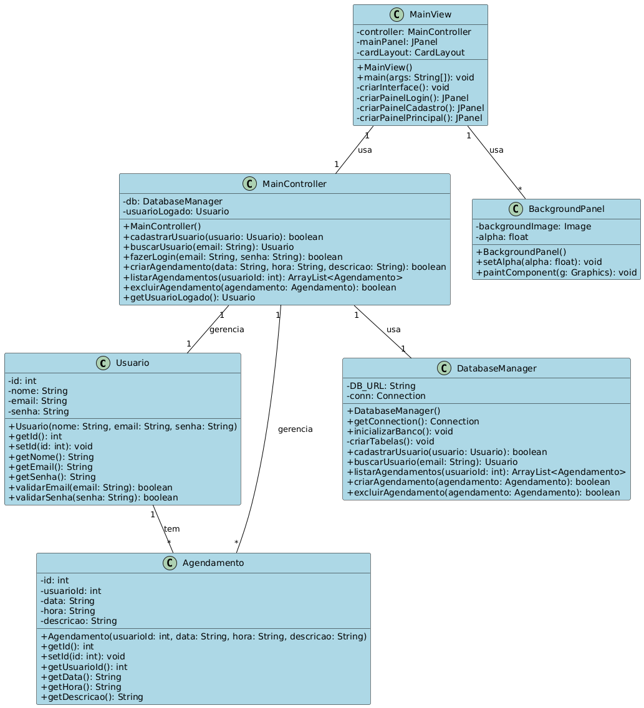
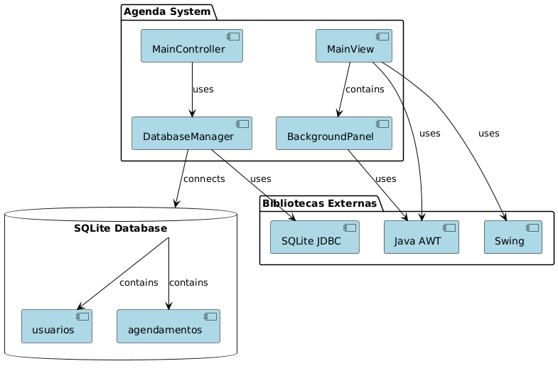
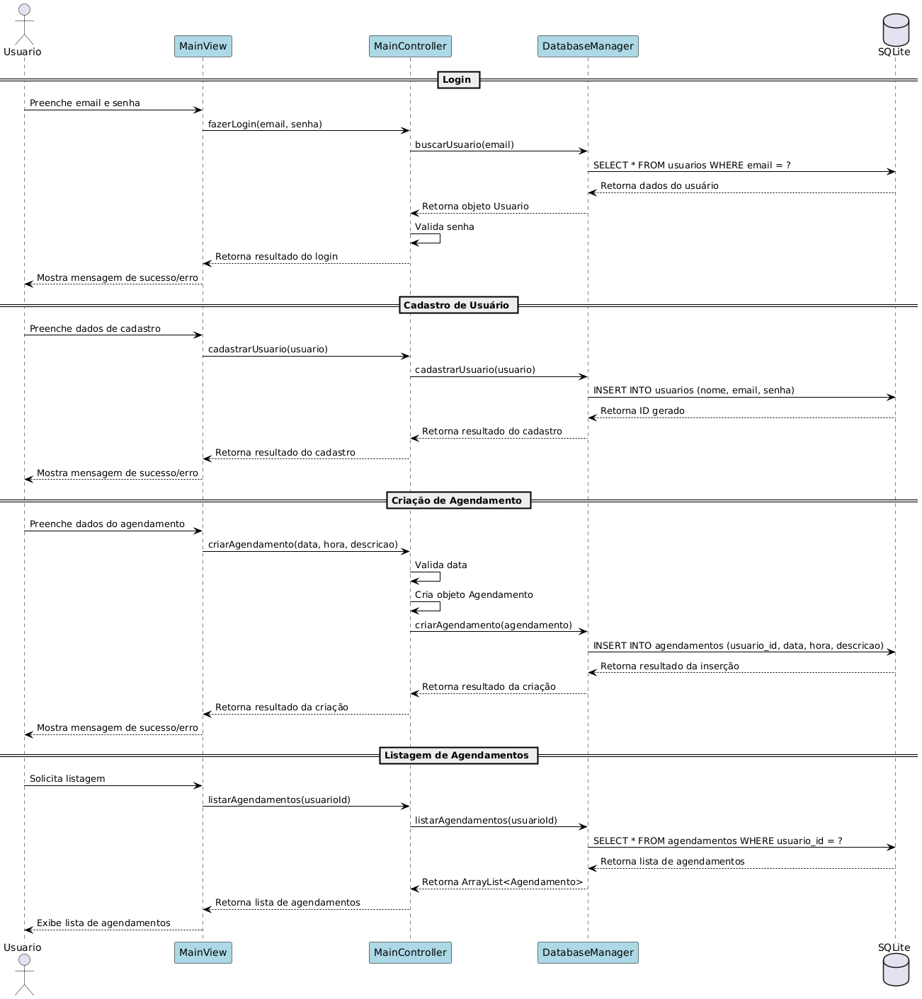

# Sistema de Agendamento de Compromissos

## Sobre o Projeto
Sistema desenvolvido em Java para gerenciamento de compromissos e agendamentos, permitindo que usuários cadastrem, visualizem e gerenciem seus compromissos de forma simples.

## Estrutura do Projeto
```
src/
├── main/
│   └── java/
│       ├── model/      # Classes de modelo e acesso a dados
│       ├── controller/ # Controladores da aplicação
│       └── view/       # Interface gráfica
├── test/
│   └── java/          # Testes unitários
└── resources/         # Recursos da aplicação
```

## Requisitos
- JDK 11 ou superior
- JUnit 4.13.2
- SQLite

## Como Executar
1. Clone o repositório
2. Compile o projeto:
   ```bash
   javac -cp "lib/*" -d bin src/main/java/model/*.java src/main/java/controller/*.java src/main/java/view/*.java
   ```
3. Execute o programa:
   ```bash
   java -cp "bin;lib/*" view.MainView
   ```

## Como Executar os Testes
1. Compile os testes:
   ```bash
   javac -cp "bin;lib/*" -d bin src/test/java/model/*.java src/test/java/controller/*.java src/test/java/view/*.java
   ```
2. Execute os testes:
   ```bash
   java -cp "bin;lib/*" org.junit.runner.JUnitCore model.UsuarioTest model.AgendamentoTest model.DatabaseManagerTest controller.MainControllerTest view.MainViewTest
   ```

## Documentação
A documentação completa do projeto está disponível na pasta `docs/`:
- [Relatório técnico](docs/ModeloProcesso.md)
- Diagrama de Classes


- Diagrama de Componentes


- Diagrama de Sequencia



## Funcionalidades
- Cadastro de usuários
- Login e autenticação
- Criação de agendamentos
- Visualização de agendamentos
- Cancelamento de agendamentos
- Interface gráfica simples 