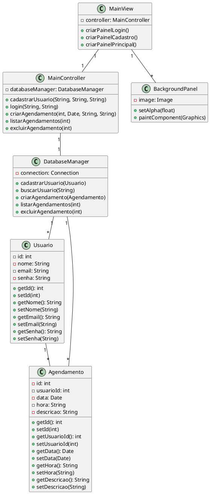
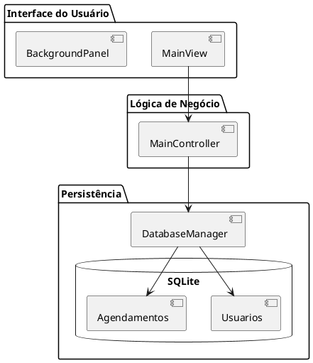
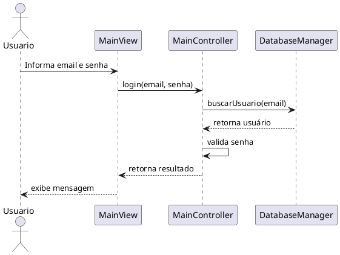

# Projeto Arquitetural

## 1. Introdução
Este documento descreve a arquitetura do Sistema de Agendamento de Compromissos, incluindo os diagramas UML e a estrutura do sistema.

## 2. Arquitetura do Sistema

### 2.1 Padrão MVC
O sistema foi desenvolvido seguindo o padrão de arquitetura MVC (Model-View-Controller):

- **Model**: Classes que representam os dados e a lógica de negócio
  - `Usuario`: Representa um usuário do sistema
  - `Agendamento`: Representa um compromisso
  - `DatabaseManager`: Gerencia o acesso ao banco de dados

- **View**: Classes responsáveis pela interface do usuário
  - `MainView`: Interface principal do sistema
  - `BackgroundPanel`: Painel com imagem de fundo

- **Controller**: Classes que controlam o fluxo da aplicação
  - `MainController`: Controlador principal que coordena as operações

### 2.2 Estrutura de Pacotes
```
src/
├── main/
│   └── java/
│       ├── model/      # Classes de modelo
│       ├── controller/ # Controladores
│       └── view/       # Interface gráfica
└── test/
    └── java/          # Testes unitários
```

## 3. Diagramas UML

### 3.1 Diagrama de Classes


### 3.2 Diagrama de Componentes


### 3.3 Diagrama de Sequência - Login


## 4. Fluxos de Dados

### 4.1 Cadastro de Usuário
1. Usuário preenche formulário de cadastro
2. View valida os dados
3. Controller processa o cadastro
4. DatabaseManager persiste os dados
5. View exibe mensagem de sucesso/erro

### 4.2 Criação de Agendamento
1. Usuário preenche formulário de agendamento
2. View valida data e hora
3. Controller processa o agendamento
4. DatabaseManager persiste os dados
5. View atualiza lista de agendamentos

### 4.3 Cancelamento de Agendamento
1. Usuário seleciona agendamento
2. View solicita confirmação
3. Controller processa o cancelamento
4. DatabaseManager remove o registro
5. View atualiza lista de agendamentos

## 5. Considerações de Implementação

### 5.1 Tratamento de Erros
- Validação de dados em todas as camadas
- Mensagens de erro claras e objetivas
- Logging de exceções para debug

### 5.2 Segurança
- Criptografia de senhas
- Validação de sessão
- Proteção contra SQL injection

### 5.3 Performance
- Conexão pool com banco de dados
- Cache de dados frequentemente acessados
- Otimização de consultas SQL 